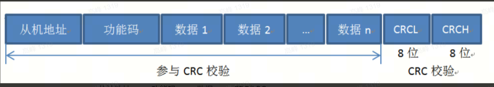

1. modbus 相关

这里的port口指的就是串口号，一般使用串口1，因为shell使用的是usb

注意串口这里的波特率是115200，使用偶校验，也可以设置其他波特率；

modbus的上位机需要选择function 03；表示读取寄存器数据

2. 电平监测逻辑

开机之后，drone_on_off(延迟1s后下拉1.5s电平)，然后开始读取1200ms，每次10，共120次结果；

验证这个120结果中，是否低电平的个数大于高电平，如果是，则更新结果buf;

3. modbus读取数据的时候，就从这个buf中获取数据，如果是1，就ok,是0，就异常
4. 举例

   01 03 00 00 00 01 84 0A  // 从0号位置开始，查询1个寄存器

   3F 3F 01 03 02 00 00 B8 44  // 返回的结果是0
   3F 3F 01 03 02 00 01 79 84 // 返回的结果是1
5. 在线crc16
   https://www.cht.nahua.com.tw/software/crc16/index.php
6. 校验位置

