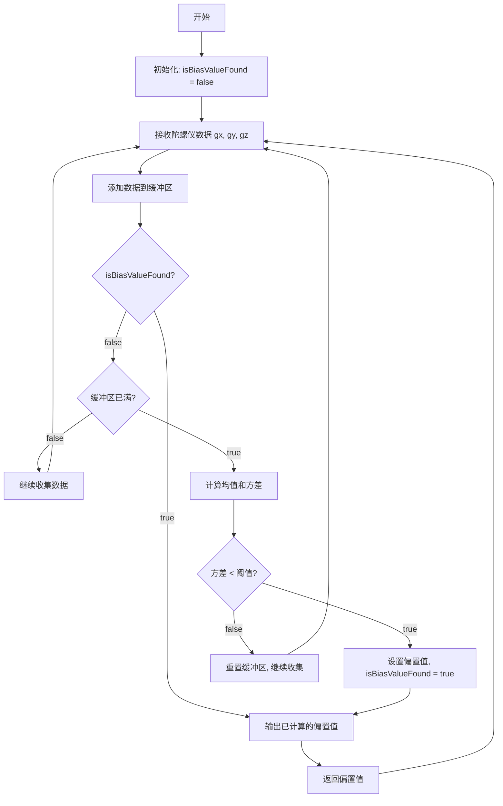
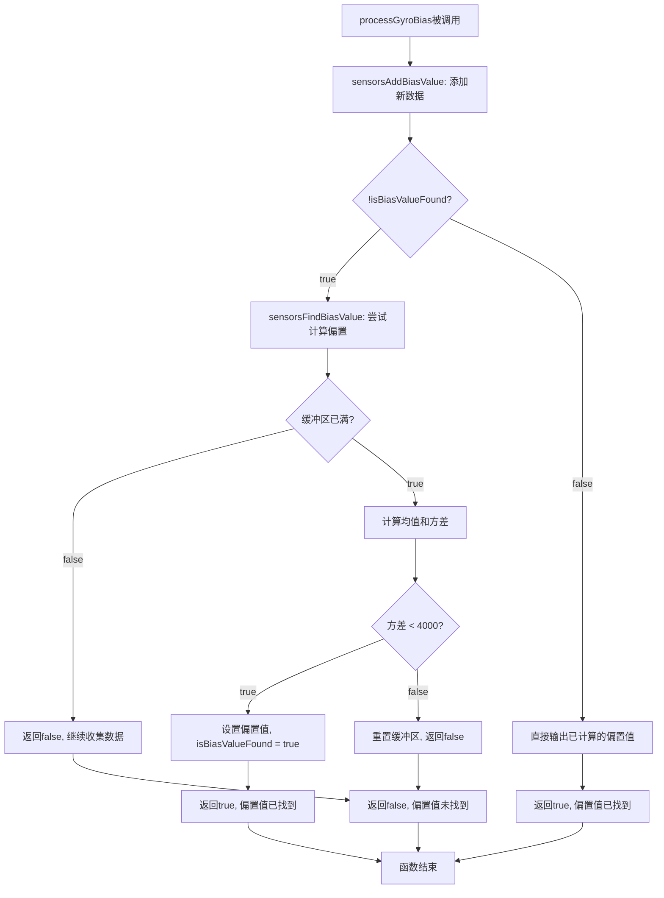

# 陀螺仪偏置计算数学原理详解

## 概述

本文档详细解释了陀螺仪偏置（Bias）计算的数学原理、算法实现和各个函数的作用。陀螺仪偏置是指陀螺仪在静止状态下输出的非零值，需要通过算法进行估计和补偿。

## 数学原理

### 1. 偏置估计的基本原理

陀螺仪偏置估计基于以下假设：
- 当飞行器静止时，陀螺仪应该输出零值
- 实际输出值与零值的差异即为偏置
- 通过多次采样取平均值来估计偏置值

### 2. 统计数学基础

#### 2.1 均值（Mean）计算
对于n个样本值 $x_1, x_2, ..., x_n$，均值计算公式为：

$$\bar{x} = \frac{1}{n}\sum_{i=1}^{n} x_i$$

在代码中，n = 1024（`SENSORS_NBR_OF_BIAS_SAMPLES`）

#### 2.2 方差（Variance）计算
方差用于衡量数据的离散程度，计算公式为：

$$\sigma^2 = \frac{1}{n}\sum_{i=1}^{n} (x_i - \bar{x})^2$$

展开后得到：

$$\sigma^2 = \frac{1}{n}\sum_{i=1}^{n} x_i^2 - \left(\frac{1}{n}\sum_{i=1}^{n} x_i\right)^2$$

即：

$$\sigma^2 = \frac{1}{n}\sum_{i=1}^{n} x_i^2 - \bar{x}^2$$

### 3. 偏置判断条件

代码中定义了方差阈值 `GYRO_VARIANCE_BASE = 4000`，当三个轴的方差都小于此阈值时，认为陀螺仪处于静止状态，可以计算偏置值。

## 数据结构

### BiasObj 结构体
```c
typedef struct {
  Axis3f bias;           // 计算得到的偏置值
  bool isBiasValueFound; // 是否已找到偏置值
  bool isBufferFilled;   // 缓冲区是否已填满
  Axis3i16 *bufHead;     // 缓冲区头指针
  Axis3i16 buffer[SENSORS_NBR_OF_BIAS_SAMPLES]; // 数据缓冲区
} BiasObj;
```

## 函数详解

### 1. `sensorsBiasObjInit()`
**作用：** 初始化偏置计算对象
**实现：**
- 设置缓冲区未填满标志
- 将头指针指向缓冲区起始位置

### 2. `sensorsAddBiasValue(BiasObj *bias, int16_t x, int16_t y, int16_t z)`
**作用：** 向缓冲区添加新的陀螺仪数据
**实现：**
- 将新的x、y、z值存入缓冲区
- 头指针向后移动
- 当缓冲区满时，头指针回到起始位置，设置缓冲区已满标志

**数学意义：** 实现循环缓冲区，确保始终保存最新的1024个数据点

### 3. `sensorsCalculateVarianceAndMean(const BiasObj *bias, Axis3f *variance_out, Axis3f *mean_out)`
**作用：** 计算方差和均值
**数学原理：**

#### 3.1 均值计算
```c
mean_out->x = (float)sum[0] / SENSORS_NBR_OF_BIAS_SAMPLES;
mean_out->y = (float)sum[1] / SENSORS_NBR_OF_BIAS_SAMPLES;
mean_out->z = (float)sum[2] / SENSORS_NBR_OF_BIAS_SAMPLES;
```

对应公式：$\bar{x} = \frac{1}{n}\sum_{i=1}^{n} x_i$

#### 3.2 方差计算
```c
variance_out->x = (sumsq[0] - ((int64_t)sum[0] * sum[0]) / SENSORS_NBR_OF_BIAS_SAMPLES);
variance_out->y = (sumsq[1] - ((int64_t)sum[1] * sum[1]) / SENSORS_NBR_OF_BIAS_SAMPLES);
variance_out->z = (sumsq[2] - ((int64_t)sum[2] * sum[2]) / SENSORS_NBR_OF_BIAS_SAMPLES);
```

对应公式：$\sigma^2 = \frac{1}{n}\sum_{i=1}^{n} x_i^2 - \left(\frac{1}{n}\sum_{i=1}^{n} x_i\right)^2$

**注意：** 这里计算的是未归一化的方差，实际方差需要除以n

### 4. `sensorsFindBiasValue(BiasObj *bias)`
**作用：** 判断是否找到有效的偏置值
**数学原理：**
- 当三个轴的方差都小于阈值时，认为陀螺仪处于静止状态
- 此时计算得到的均值即为偏置值
- 如果方差过大，说明陀螺仪仍在运动，重置缓冲区

**判断条件：**
```c
if (variance.x < GYRO_VARIANCE_BASE && 
    variance.y < GYRO_VARIANCE_BASE && 
    variance.z < GYRO_VARIANCE_BASE)
```

### 5. `processGyroBias(int16_t gx, int16_t gy, int16_t gz, Axis3f *gyroBiasOut)`
**作用：** 主要的偏置处理函数
**工作流程：**
1. 添加新的陀螺仪数据到缓冲区
2. 如果还未找到偏置值，尝试计算
3. 输出当前估计的偏置值
4. 返回是否已找到有效偏置值

**重要特性：** 一旦 `isBiasValueFound` 被设置为 `true`，后续调用将不再重新计算偏置值，直接使用已计算的结果

## 算法流程图

### 整体流程


### 关键代码执行流程


**关键点说明：**
- 一旦 `isBiasValueFound = true`，后续调用将跳过 `sensorsFindBiasValue` 函数
- 偏置值被计算并保存后，永远不会被重新计算
- 数据缓冲区继续更新，但不再影响已计算的偏置值

## 算法特点
- 使用1024个数据点的滑动窗口
- 新数据不断覆盖旧数据
- 确保偏置估计基于最新的数据

### 2. 方差阈值判断
- 通过方差判断陀螺仪是否静止
- 方差阈值4000是一个经验值，可根据实际情况调整

### 3. 一次性计算
- **关键特性：** 偏置值只计算一次，一旦找到有效值就不再重新计算
- 这确保了偏置值的稳定性，避免因后续数据变化导致的偏置漂移
- 适用于静态校准场景，如飞行器起飞前的校准

### 4. 实时性
- 每次调用都会更新数据缓冲区
- 但偏置值保持固定，直到重新初始化

## 数学公式总结

### 均值计算
$$\bar{x} = \frac{1}{n}\sum_{i=1}^{n} x_i$$

### 方差计算
$$\sigma^2 = \frac{1}{n}\sum_{i=1}^{n} x_i^2 - \left(\frac{1}{n}\sum_{i=1}^{n} x_i\right)^2$$

### 偏置估计
$$bias = \bar{x} = \frac{1}{n}\sum_{i=1}^{n} x_i$$

### 静止判断条件
$$\sigma_x^2 < threshold \land \sigma_y^2 < threshold \land \sigma_z^2 < threshold$$

## 应用场景

1. **飞行器初始化**：起飞前进行陀螺仪校准（主要应用场景）
2. **传感器校准**：提高姿态估计精度
3. **静态环境校准**：实验室或测试环境下的传感器标定

**注意：** 由于偏置值只计算一次，此算法不适用于需要动态跟踪偏置变化的场景

## 注意事项

1. 方差阈值需要根据实际应用场景调整
2. 1024个采样点需要在静止状态下采集
3. **偏置值只计算一次，不会自动更新**，如需重新校准需要重新初始化
4. 计算过程中使用64位整数避免溢出
5. 此算法适用于静态校准，不适合动态环境下的偏置跟踪 