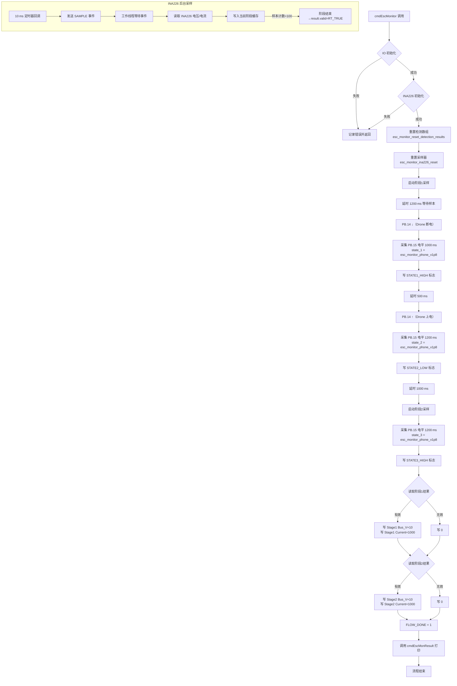
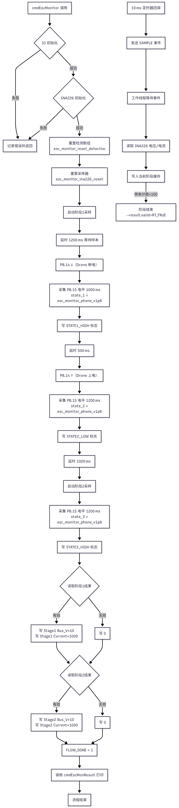

# `cmdEscMonitor` 电压/电流采集流程

## 概述

- 负责在 ESC 上电流程中操控 `PB.14`（DroneOnOff）并采样 `PB.15`（PhoneOnV1P8），同时驱动 INA226 完成两阶段电压、电流采集。
- 定时器仅以 10 ms 周期触发事件，由后台工作线程完成实际 INA226 读取与 100 组样本累计，产出均值/中值结果。
- 采样结果写入 `esc_monitor_detection_`，随后经 Modbus 保持寄存器同步给上位机；上位机基于寄存器值执行阈值判定。

## 流程图

## 关键时序

- 阶段1：启动采样后先等待 1200 ms，以便线程积累足够样本，再进行 PB.15 电平统计与标志登记。
- 阶段2：PB.14 再次拉高后，先延时 1000 ms 以确保阶段1收尾，再启动第二阶段采样并同步统计电平。
- 每个阶段结束后，如果采样有效，则将
  - `bus_voltage_median × 10` 写入 `ESC_MONITOR_DETECTION_INDEX_STAGE{1,2}_BUS_VOLTAGE_X10`
  - `shunt_current_median × 1000` 写入 `ESC_MONITOR_DETECTION_INDEX_STAGE{1,2}_CURRENT_MA`
    若结果无效则填 0。
- 最后置位 `FLOW_DONE` 并打印概览，Modbus 线程会周期性读取 `esc_monitor_detection_` 写入保持寄存器。

## 上位机解析

- 电压寄存器除以 10 得到伏特，电流寄存器除以 1000 得到安培。
- `STATE1/2/3` 与 `FLOW_DONE` 为布尔位（0/1），可用来判定流程是否顺利执行以及 PB.15 的电平状态。

