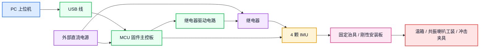
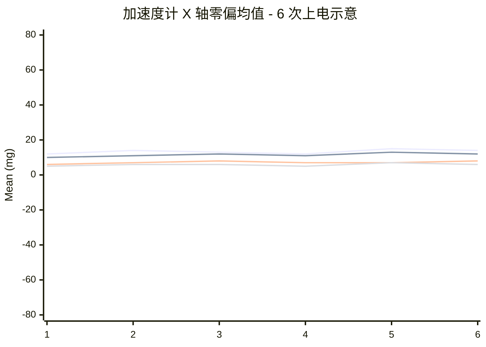
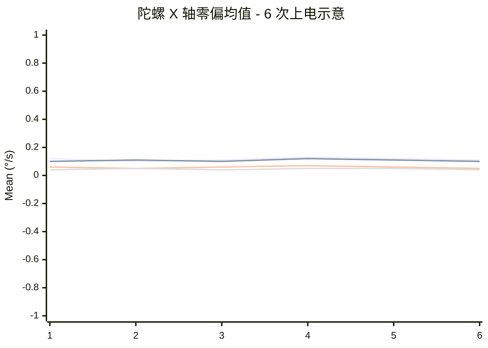

# 测试过程和结果

## 1. 文档信息

| 日期       | 版本 | 描述                         | 作者 |
| ---------- | ---- | ---------------------------- | ---- |
| 2026-03-19 | V1.0 | 测试过程与结果合并版文档     |      |

## 2. 测试目的

本文档用于记录 `ICM45686` 与 `ICM42688` 的测试方式、测试配置、测试数据和测试结论。

## 3. 纸面指标对比

| 指标                   | 判定关注点       | ICM42688-P          | ICM45686         | 纸面结论            |
| ---------------------- | ---------------- | ------------------- | ---------------- | ------------------- |
| Accel Zero Bias        | `<= 80 mg`       | `20 mg`             | `20 mg`          | 一致                |
| Gyro Zero Bias         | `<= 1 °/s`       | `0.5 °/s`           | `0.4 °/s`        | `ICM45686` 略优     |
| Accel Bias TC          | `<= 0.2 mg/°C`   | `0.15 mg/°C`        | `0.15 mg/°C`     | 一致                |
| Gyro Bias TC           | `<= 0.01 °/s/°C` | `0.005 °/s/°C`      | `0.005 °/s/°C`   | 一致                |
| Accel Noise Density    | —                | `70 µg/√Hz`         | `70 µg/√Hz`      | 一致                |
| Gyro Noise Density     | —                | `0.0028 °/s/√Hz`    | `0.0038 °/s/√Hz` | `ICM42688` 纸面更优 |
| Gyro ARW (换算)        | `<= 0.30 °/√hr`  | `≈ 0.168 °/√hr`     | `≈ 0.228 °/√hr`  | `ICM42688` 纸面更优 |

## 4. 测试配置

### 4.1 样本配置

本次测试按 `2 x 2` 配置执行：

- `ICM45686`: `A1`、`A2`
- `ICM42688`: `B1`、`B2`

### 4.2 装配要求

- 四颗 IMU 安装在同一刚性结构上
- 使用同一版本主控板、同一供电、同一采样链路
- 四颗 IMU 使用一致的量程和滤波参数
- ODR 按器件支持的最近档位配置：
  - `ICM42688`: `1000 Hz`
  - `ICM45686`: `1600 Hz`
- 数据分析时按实际 ODR 进行时间对齐和归一化处理
- 同一轮测试同时上电、同时开始采样、同时结束采样
- 每完成一轮测试后交换物理位置再进行下一轮

### 4.3 治具和工装说明

#### 4.3.1 治具和工装组成



- 外部直流电源
- `1` 块 MCU 固件主控板
- 继电器
- 继电器驱动电路
- `4` 颗 IMU
- `1` 台 PC 上位机
- USB 线
- 固定治具 / 刚性安装板
- 温箱、低频共振喇叭工装、冲击夹具

#### 4.3.2 MCU 固件

MCU 固件负责：

- 初始化全部 IMU
- 设置统一采样参数
- 周期采集四颗 IMU 原始数据
- 将采样数据实时写入 SD 卡
- 输出时间戳、帧号、设备号、加速度、角速度、温度、状态位
- 通过 USB 串口响应测试控制命令，回传测试状态和进度
- 支持按测试项目执行控制，包括 `zero_bias`、`temp_drift`、`arw`、`vib_normal`、`vib_over`、`shock_normal`、`shock_over` 的启动、停止和参数配置

数据存储链路：

`IMU -> MCU -> SD 卡 -> PC 读取`

控制链路：

`PC 上位机 <-> USB 串口 <-> MCU 固件`

#### 4.3.3 PC 上位机

PC 上位机负责下发测试控制命令、显示测试进度；测试完成后从 SD 卡读取数据文件进行分析。

PC 端提供一个测试应用程序界面，界面包含以下区域：

- 串口选择与连接
- 测试项目选择与参数配置
- 开始 / 停止测试按钮
- 测试进度与状态显示
- 日志显示区

PC 上位机负责：

- 通过串口下发测试控制命令
- 实时显示测试进度和状态
- 测试完成后从 SD 卡读取数据并进行分析

界面流程如下：


测试项目下拉选项包括：

- `zero_bias`
- `temp_drift`
- `arw`
- `vib_normal`
- `vib_over`
- `shock_normal`
- `shock_over`

#### 4.3.4 分析脚本

分析脚本负责：

- 读取 CSV 数据和 `metadata.json`
- 按测试项目执行指标计算
- 输出统计表和图表
- 生成测试结论摘要
- 回写或更新测试结果文档

### 4.4 通用采集配置

| 参数         | ICM42688               | ICM45686               |
| ------------ | ---------------------- | ---------------------- |
| ODR          | `1000 Hz`              | `1600 Hz`              |
| Accel Range  | `16 g`                 | `16 g`                 |
| Gyro Range   | `2000 dps`             | `2000 dps`             |
| 数据格式     | 原始数据               | 原始数据               |
| 时间同步     | 同一 MCU 时间基准      | 同一 MCU 时间基准      |
| 安装方式     | 同一刚性底板           | 同一刚性底板           |
| 供电         | 同一电源、同一线束规格 | 同一电源、同一线束规格 |

> **注**：由于两款 IMU 支持的 ODR 档位不同，采用各自最接近 `1 kHz` 的配置。数据分析时需按实际 ODR 进行时间归一化。

### 4.5 数据文件

```text
data/
  {date}_{test_item}_run{nn}/
    metadata.json
    imu_A1.csv
    imu_A2.csv
    imu_B1.csv
    imu_B2.csv
```

`metadata.json` 记录：

- 测试项
- 测试时间
- 固件版本
- 采样参数
- 样本编号
- 环境信息
- 备注

CSV 文件按测试项目分别导出，不同测试项目的表头允许不同。

统一规则如下：

- 第一列为时间字段
- 第二列为温度字段
- 后续列按 `IMU 型号 + 序号` 展开对应数据
- 每个样本至少包含 `acc_x/acc_y/acc_z` 和 `gyro_x/gyro_y/gyro_z`
- 原始 CSV 以最小必要字段为主，测试过程中的事件识别、饱和判定、恢复判定等结果由离线分析脚本计算

各测试项目 CSV 表头说明如下：

| 测试项 | CSV 表头说明 |
| ---- | ---- |
| 零偏及零偏稳定性 | `time,temp,A1_acc_x,A1_acc_y,A1_acc_z,A1_gyro_x,A1_gyro_y,A1_gyro_z,A2_...,B1_...,B2_...` |
| 温漂 | `time,temp,A1_acc_x,A1_acc_y,A1_acc_z,A1_gyro_x,A1_gyro_y,A1_gyro_z,A2_...,B1_...,B2_...` |
| ARW / 噪声 | `time,temp,A1_acc_x,A1_acc_y,A1_acc_z,A1_gyro_x,A1_gyro_y,A1_gyro_z,A2_...,B1_...,B2_...` |
| 振动 90% 量程 | `time,A1_acc_z,A2_acc_z,B1_acc_z,B2_acc_z` |
| 超量程振动 | `time,A1_acc_z,A2_acc_z,B1_acc_z,B2_acc_z` |
| 冲击后恢复-未超量程 | `time,A1_acc_x,A1_acc_y,A1_acc_z,A1_gyro_x,A1_gyro_y,A1_gyro_z,A2_...,B1_...,B2_...` |
| 冲击后恢复-超量程 | `time,A1_acc_x,A1_acc_y,A1_acc_z,A1_gyro_x,A1_gyro_y,A1_gyro_z,A2_...,B1_...,B2_...` |

## 5. 测试执行流程

### 5.1 测试前检查

1. 固定四颗 IMU
2. 检查接线、供电和单串口连接
3. 确认样本编号与文件名一致
4. 配置 ODR、量程、滤波参数
5. 记录测试项、轮次和备注

### 5.2 采集流程

1. 上电
2. 打开上位机
3. 选择串口并建立连接
4. 通过下拉框选择测试项
5. 下发配置
6. 启动采样
7. 实时显示测试进度和串口上报数据
8. 实时保存 CSV 数据
9. 到达设定时长后停止采样
10. 保存 `metadata.json`
11. 由上位机导出本轮测试数据
12. 使用分析脚本对测试数据进行统计和分析
13. 输出图表、统计结果和测试结论

### 5.3 命名规则

- 轮次目录：`{date}_{test_item}_run{nn}`
- 样本文件：`imu_A1.csv`、`imu_A2.csv`、`imu_B1.csv`、`imu_B2.csv`

## 6. 测试结果分析与结论输出

测试结束后，由分析脚本对上位机导出的 CSV 数据和 `metadata.json` 进行统一处理。

处理流程如下：

1. 读取本轮测试目录下的 `metadata.json`
2. 读取对应测试项目的 CSV 数据文件
3. 按样本拆分 `A1`、`A2`、`B1`、`B2` 数据
4. 按测试项目执行对应的指标计算
5. 生成统计表和曲线图
6. 汇总同型号样本结果
7. 输出 `ICM45686` 与 `ICM42688` 的对比结论
8. 生成测试结论摘要并写入结果文档

脚本输出内容包括：

- 单样本统计结果
- 同型号汇总结果
- 对比图表
- 异常标记
- 最终测试结论

最终输出形式包括：

- 统计结果表
- 图表文件
- 结论摘要
- 更新后的测试结果文档

## 7. 测试结果

### 7.1 零偏及零偏稳定性

**测试条件**

| 参数     | 值             |
| -------- | -------------- |
| 环境温度 | `25 ± 2°C`     |
| 安装方向 | `Z` 轴朝上     |
| 单次时长 | `1 min`        |
| 重复上电 | `6` 次         |
| 上电间隔 | `>= 1 hour`    |

统计说明：

- 每次上电静置采集 `1 min`
- 对每一个样本、每一个轴，`6` 次上电共得到 `6` 段独立的 `1 min` 数据
- 先分别计算每一段 `1 min` 数据的均值，作为该次上电、该轴的零偏结果
- 再对 `6` 次上电得到的 `6` 个段均值求平均，作为表中的该轴“均值”
- 表中的该轴“标准差”按这 `6` 个段均值计算样本标准差，用于表征上电间离散性
- 表中的该轴“极差”按这 `6` 个段均值计算，即 `max - min`
- 用多次上电结果比较零偏变化和上电稳定性

计算口径示例如下：

- 以某样本 `X` 轴为例，第 `i` 次上电的 `1 min` 数据共有 `N_i` 个采样点，先计算该段均值

`mu_i = (1 / N_i) * sum(x_{i,k}),  k = 1 ... N_i`

- 共 `6` 次上电，则该轴最终均值为

`mu = (1 / 6) * sum(mu_i),  i = 1 ... 6`

- 该轴上电间标准差为

`sigma = sqrt((1 / (6 - 1)) * sum((mu_i - mu)^2)),  i = 1 ... 6`

- 若需要给出“单次静置噪声”或“段内稳定性”，则应在每一段 `1 min` 数据内部单独计算段内标准差；该值不与这里的上电间标准差混用

结果展示方式：

- 零偏项目的主展示图采用“`6` 次上电均值曲线图”
- 横坐标固定为 `1 ~ 6`，分别表示第 `1` 次到第 `6` 次上电
- 纵坐标为该次上电后 `1 min` 数据段的该轴均值
- 加速度计单位用 `mg`
- 陀螺单位用 `°/s`
- 每张图固定一个轴，图中同时放 `A1`、`A2`、`B1`、`B2` 共 `4` 条曲线，便于同一轴下直接比较四个样本
- 曲线图用于直观看同一轴均值是否随上电轮次发生漂移、跳变或离散
- 表格中再补充最终 `6` 次均值的总体均值和方差，用于汇总结论
- 因此零偏项目总共建议放 `6` 张图：
  - 加速度计 `X / Y / Z` 各 `1` 张，共 `3` 张
  - 陀螺 `X / Y / Z` 各 `1` 张，共 `3` 张

**加速度计零偏曲线图示意（每张图固定一个轴，含 4 条样本曲线）**



上图的实际含义是：

- 该图固定展示“加速度计 `X` 轴”
- 图中的 `4` 条线分别对应 `A1`、`A2`、`B1`、`B2`
- 第 `1` 个点表示“第 `1` 次上电后，取该样本该轴 `1 min` 数据段均值”
- 第 `2` 个点表示“第 `2` 次上电后，取该样本该轴 `1 min` 数据段均值”
- 依此类推，一直到第 `6` 次上电

最终可同时给出：

- `X_mean_final = mean(X_1, X_2, ..., X_6)`
- `Y_mean_final = mean(Y_1, Y_2, ..., Y_6)`
- `Z_mean_final = mean(Z_1, Z_2, ..., Z_6)`
- `X_var_final = var(X_1, X_2, ..., X_6)`
- `Y_var_final = var(Y_1, Y_2, ..., Y_6)`
- `Z_var_final = var(Z_1, Z_2, ..., Z_6)`

**陀螺零偏曲线图示意（每张图固定一个轴，含 4 条样本曲线）**



建议最终在 `7.1` 中按以下顺序呈现：

1. 加速度计 `X / Y / Z` 三张图，每张图 `4` 条样本曲线
2. 陀螺 `X / Y / Z` 三张图，每张图 `4` 条样本曲线
3. 每个样本的最终均值 / 方差汇总表
4. 同型号样本之间的结论对比

**加速度计零偏结果（单位：mg）**

| 样本 | 型号     | X 均值 | Y 均值 | Z 均值 | X 极差 | Y 极差 | Z 极差 | 上电间偏差 |
| ---- | -------- | ------ | ------ | ------ | ------ | ------ | ------ | ---------- |
| A1   | ICM45686 |        |        |        |        |        |        |            |
| A2   | ICM45686 |        |        |        |        |        |        |            |
| B1   | ICM42688 |        |        |        |        |        |        |            |
| B2   | ICM42688 |        |        |        |        |        |        |            |

**陀螺零偏结果（单位：°/s）**

| 样本 | 型号     | X 均值 | Y 均值 | Z 均值 | X 极差 | Y 极差 | Z 极差 | 上电间偏差 |
| ---- | -------- | ------ | ------ | ------ | ------ | ------ | ------ | ---------- |
| A1   | ICM45686 |        |        |        |        |        |        |            |
| A2   | ICM45686 |        |        |        |        |        |        |            |
| B1   | ICM42688 |        |        |        |        |        |        |            |
| B2   | ICM42688 |        |        |        |        |        |        |            |

**结论**

| 对比项         | 结论 |
| -------------- | ---- |
| 加计零偏均值   |      |
| 加计一致性     |      |
| 陀螺零偏均值   |      |
| 陀螺一致性     |      |
| 上电重复性     |      |

### 7.2 温漂

**测试条件**

| 参数     | 值                       |
| -------- | ------------------------ |
| 温度范围 | `5 ~ 50°C`               |
| 温度点   | `5/10/20/30/40/50°C`     |
| 保温时长 | `20 min`                 |
| 统计窗口 | 末尾 `5 min`             |

**温漂指标汇总**

| 型号     | Accel TC (mg/°C) | Gyro TC (°/s/°C) | 备注 |
| -------- | ---------------- | ---------------- | ---- |
| ICM45686 |                  |                  |      |
| ICM42688 |                  |                  |      |

**结论**

| 对比项       | 结论 |
| ------------ | ---- |
| 加计温漂     |      |
| 陀螺温漂     |      |

### 7.3 ARW / 噪声

**测试条件**

| 参数 | 值           |
| ---- | ------------ |
| 环境 | 常温静置     |
| 时长 | `1 h`        |

说明：

- 正式测试连续记录 `1 h`
- 若仅做快速摸底，最低不少于 `30 min`
- 结果表和汇总方式先保留

**结果汇总**

| 样本 | 型号     | Gyro RMS | ARW | Allan 曲线特征 | 备注 |
| ---- | -------- | -------- | --- | -------------- | ---- |
| A1   | ICM45686 |          |     |                |      |
| A2   | ICM45686 |          |     |                |      |
| B1   | ICM42688 |          |     |                |      |
| B2   | ICM42688 |          |     |                |      |

**结论**

| 对比项     | 结论 |
| ---------- | ---- |
| 噪声水平   |      |
| ARW 水平   |      |
| 样本一致性 |      |

### 7.4 振动 / 超量程振动

**振动 90% 量程测试条件**

| 参数 | 值 |
| ---- | ---- |
| 激励方式 | 低频共振喇叭 + 功放 |
| 观测目标 | IMU 主响应轴接近 `90% FS` |
| 峰值保持时间 | `1 s` |
| 目标 | 观察大振动下数据是否连续、是否符合物理趋势 |

**超量程振动测试条件**

| 参数 | 值 |
| ---- | ---- |
| 激励方式 | 继续提高喇叭驱动功率 |
| 观测目标 | IMU 主响应轴疑似进入超量程边界 |
| 峰值保持时间 | `1 s` |
| 目标 | 观察贴边 / 削顶、丢帧和恢复行为 |

**结果汇总**

| 样本 | 型号     | 高幅丢帧 | 高幅波形合理性 | 备注 |
| ---- | -------- | -------- | -------------- | ---- |
| A1   | ICM45686 |          |                |      |
| A2   | ICM45686 |          |                |      |
| B1   | ICM42688 |          |                |      |
| B2   | ICM42688 |          |                |      |

**结论**

| 对比项       | 结论 |
| ------------ | ---- |
| 是否突然不出数据 |      |
| 高幅波形是否合理 |      |

### 7.5 冲击后恢复

**未超量程冲击测试条件**

| 参数 | 值 |
| ---- | ---- |
| 冲击幅度 | 不超过加计量程 |
| 目标 | 模拟跌落或轻度炸机场景后的恢复表现 |

**超量程冲击测试条件**

| 参数 | 值 |
| ---- | ---- |
| 冲击幅度 | 超过加计量程 |
| 目标 | 观察超量程冲击后的连续性、恢复能力和机械完整性 |

**结果汇总**

| 样本 | 型号     | 未超量程是否掉线 | 未超量程恢复时间 | 超量程是否掉线 | 超量程是否复位 | 超量程恢复时间 | 结构是否损坏 | 备注 |
| ---- | -------- | ---------------- | ---------------- | -------------- | -------------- | -------------- | ------------ | ---- |
| A1   | ICM45686 |                  |                  |                |                |                |              |      |
| A2   | ICM45686 |                  |                  |                |                |                |              |      |
| B1   | ICM42688 |                  |                  |                |                |                |              |      |
| B2   | ICM42688 |                  |                  |                |                |                |              |      |

**结论**

| 对比项     | 结论 |
| ---------- | ---- |
| 未超量程冲击恢复 |      |
| 超量程冲击恢复   |      |
| 数据连续性       |      |
| 机械完整性       |      |

## 8. 总体结论

| 结论项       | 结果 |
| ------------ | ---- |
| 是否可替换   |      |
| 主要优势     |      |
| 主要风险     |      |
| 约束条件     |      |
| 后续动作     |      |

## 9. 附录

### 9.1 控制命令

以下命令通过同一个串口由 PC 应用程序下发到 MCU：

- ODR、加速度计量程、陀螺量程等通用采样参数由 MCU 在开机后自动完成全部 IMU 初始化，测试过程中不提供在线设置命令

| 命令                          | 说明               |
| ----------------------------- | ------------------ |
| `imu_test start zero_bias`    | 启动零偏测试       |
| `imu_test start temp_drift`   | 启动温漂测试       |
| `imu_test start arw`          | 启动 ARW / 噪声测试|
| `imu_test start vib_normal`   | 启动振动测试       |
| `imu_test start vib_over`     | 启动超量程振动测试 |
| `imu_test start shock_normal` | 启动未超量程冲击恢复测试 |
| `imu_test start shock_over`   | 启动超量程冲击恢复测试 |
| `imu_test stop`               | 停止当前测试       |
| `imu_status`                  | 查看当前状态       |
| `imu_list`                    | 列出当前 IMU       |
