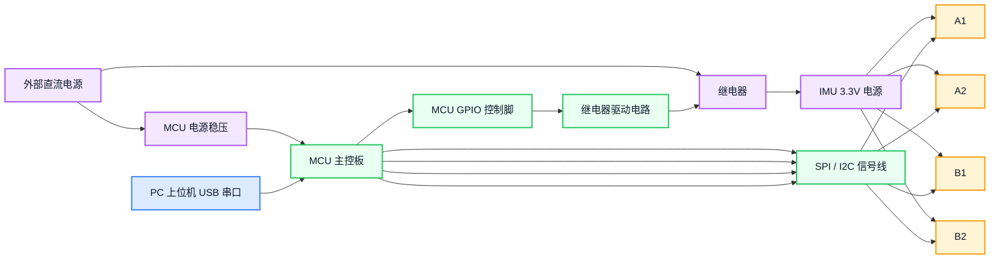

# 各方案选项备注

## 1. 文档目的

本文档记录 IMU 对比测试方案的设计依据，说明"为什么这样测"。

`01-测试过程和结果.md` 侧重"怎么测、结果是什么"；本文档侧重"为什么选这个方案"。

## 2. 采集链路选择说明

本次测试固定采用：

`MCU -> SD 卡本地记录 -> 测试结束后导出文件 -> PC 分析脚本`

采用该链路的原因如下：

- 振动和冲击测试的关键在于高瞬态阶段不能丢样，`SD 卡本地记录` 的吞吐量余量明显大于单串口实时上传
- MCU 可以按 IMU 原始节奏读取 FIFO 并直接写入 SD 卡，避免串口带宽成为主限制
- 更适合记录振动、超量程振动和冲击恢复这类短时高动态过程
- 测试过程中不必实时做复杂判断，原始数据完整保留，后续统一由分析脚本离线计算指标
- 数据链路更贴近最终测试目标，即“先完整记录，再做结果分析”
- 对于 `4 IMU`、`1 kHz ODR`、FIFO 模式等配置，更容易保证持续记录稳定性

### 2.1 选择 SD 卡作为主记录链路的原因

问题背景：

- 振动和冲击过程中的有效变化时间通常很短，重点是观察 IMU 在高动态阶段是否出现丢包、断流、停滞值和异常跳变
- 当前通用配置为 `4` 颗 IMU 同时采样，`ODR = 1000 Hz`
- 这类场景优先要求“记录完整”，其次才是“测试过程中是否实时看到数据”

采用 `SD 卡本地记录` 的主要优势：

- 记录链路不再受单串口波特率上限约束
- MCU 可以直接把 FIFO 原始数据按批次写入 SD 卡，更适合高吞吐量场景
- 振动和冲击期间不用在 MCU 端实时输出结果字段，减少在线处理负担
- 即使测试过程较短，只要原始数据完整保存，后续都可以离线复算指标
- 更适合当前已经明确的测试方式：振动项目看 FIFO 包数异常和原始点异常占比，冲击项目看恢复过程和异常点统计

对振动 / 冲击测试的实际意义：

- 采样链路的首要目标变成“不要漏记原始数据”
- 大振动和冲击时，MCU 不需要一边保证实时上传、一边承担判断逻辑
- 所有结果指标统一由分析脚本从 SD 卡导出的原始 CSV 中计算，口径更一致

因此，当前最佳主链路选择改为：

`MCU -> SD 卡本地记录 -> 测试结束后导出文件 -> PC 分析脚本`

### 2.2 USB 串口的定位

`USB 串口` 仍然保留，但不再作为主数据记录链路。

USB 串口更适合承担：

- 测试命令下发
- 测试状态查看
- LED、日志、调试信息输出
- 采样开始 / 停止控制
- 必要时导出简化预览数据

不再建议 USB 串口承担：

- 振动 / 冲击过程中的全量原始数据主记录
- 高频多 IMU 原始数据持续实时上传
- 在线计算并回传复杂判断结果

原因是：

- 串口更容易在高动态测试中成为瓶颈
- 实时上传会占用 MCU 处理时间和带宽余量
- 与当前“先完整记录，再离线分析”的测试策略不一致

### 2.3 其他方案备注

#### 2.3.1 Wi-Fi / 服务器直传

未将 `ESP32 / Wi-Fi / 服务器` 作为当前主链路，原因如下：

- 会引入网络延迟、丢包、重传和缓存等额外变量
- 需要同时建设服务端接口、存储和运维链路
- 会增加问题定位复杂度
- 当前测试目标是完成 IMU 对比验证，不是网络链路验证

如后续需要远程查看结果，可由 `PC` 在本地保存后异步上传汇总结果。

## 3. 测试结果指标计算说明

本节说明各测试项目的结果指标如何从 CSV 数据中计算得到。

通用约定：

- `time` 为时间列
- `temp` 为温度列
- `A1_acc_x` 表示样本 `A1` 的加速度 `x` 轴数据
- `A1_gyro_x` 表示样本 `A1` 的陀螺 `x` 轴数据
- 其余样本 `A2`、`B1`、`B2` 的计算方法相同
- 若某项统计针对单轴进行，则 `x/y/z` 轴分别独立计算
- 若某项统计针对型号进行，则先算每个样本，再做型号内汇总

### 3.1 测试项目 1：零偏及零偏稳定性

怎么做：

- 常温静置
- 间隔 `1 hour` 以上重复上电
- 每次上电后采集 `1 min`
- 对比不同上电轮次下的零偏变化

CSV 数据来源：

- `time`
- `temp`
- `A1_acc_x ~ B2_acc_z`
- `A1_gyro_x ~ B2_gyro_z`

核心指标：

- 加计零偏均值
- 陀螺零偏均值
- `1 min` 内波动
- 上电间偏差
- 同型号双样本一致性

指标计算方法：

- 零偏均值：
  `bias_mean = (1 / N) * Σ x_i`

- `1 min` 内波动标准差：
  `std = sqrt((1 / (N - 1)) * Σ (x_i - bias_mean)^2)`

- 极差：
  `range = max(x_i) - min(x_i)`

- 上电间偏差：
  `power_cycle_delta = max(bias_mean_run_k) - min(bias_mean_run_k)`

- 一致性：
  `sample_std = std(bias_mean_A1, bias_mean_A2)` 或 `std(bias_mean_B1, bias_mean_B2)`

为什么用这些指标：

- 零偏均值直接反映静止状态下的偏置水平
- `1 min` 内波动反映短时稳定性
- 上电间偏差反映重复上电后的漂移风险
- 双样本一致性反映同型号个体差异

测试汇总结果表达：

- 单样本：`X/Y/Z` 轴零偏均值、标准差、极差、上电间偏差
- 型号汇总：均值对比、一致性对比、重复上电稳定性对比
- 结论：`更优 / 接近 / 明显劣化`

### 3.2 测试项目 2：温漂

怎么做：

- 分为小温冲和大温冲两种场景
- 小温冲：温度变化速率 `< 0.5°C/s`
- 大温冲：温度变化速率 `> 5°C/s`
- 温度点：`5 / 10 / 20 / 30 / 40 / 50°C`
- 每个温度点保持 `20 min`
- 每个温度点取末尾 `5 min` 作为稳定统计窗口

CSV 数据来源：

- `time`
- `temp`
- `A1_acc_x ~ B2_acc_z`
- `A1_gyro_x ~ B2_gyro_z`

核心指标：

- 小温冲 Accel TC
- 小温冲 Gyro TC
- 大温冲 Accel TC
- 大温冲 Gyro TC
- 升降温滞回
- 温冲敏感性

指标计算方法：

- 每个温度点均值：
  `mean_T = (1 / N_T) * Σ x_i`

- 温漂拟合：
  `x(T) = k * T + b`

- 温漂系数：
  `TC = k`

- 两点近似：
  `TC = (mean_T2 - mean_T1) / (T2 - T1)`

- 升降温滞回：
  `hysteresis(T) = mean_heat(T) - mean_cool(T)`

- 最大滞回：
  `max_hysteresis = max(|hysteresis(T)|)`

为什么用这些指标：

- 温漂本质就是输出对温度的斜率
- 小温冲和大温冲可区分缓变温度与激烈温冲场景
- 同温点升降温差值可反映热滞回
- 末尾稳定窗口可减少瞬态阶段对结果的干扰

测试汇总结果表达：

- 单样本：各温度点零偏表、拟合斜率、滞回值
- 型号汇总：小温冲温漂、大温冲温漂、最大滞回
- 结论：`小温冲谁更稳`、`大温冲谁更敏感`、`是否存在明显热滞回`

### 3.3 测试项目 3：角度随机游走 ARW / 噪声

怎么做：

- 常温静置
- 长时间连续采集陀螺数据
- 单轮正式测试记录时长统一取 `1 h`
- 若仅做快速摸底，最低也应连续记录不少于 `30 min`

CSV 数据来源：

- `time`
- `temp`
- `A1_gyro_x ~ B2_gyro_z`
- 可选 `status`

核心指标：

- Gyro RMS
- ARW
- Allan 曲线特征
- 同型号样本一致性

指标计算方法：

- 去均值序列：
  `w_i' = w_i - mean(w)`

- RMS：
  `RMS = sqrt((1 / N) * Σ (w_i')^2)`

- Allan variance：
  `AVAR(tau) = (1 / 2) * mean((y_(k+1) - y_k)^2)`

- Allan deviation：
  `ADEV(tau) = sqrt(AVAR(tau))`

- ARW：
  从 Allan deviation 在 `-1/2` 斜率区间提取

为什么用这些指标：

- RMS 反映时域噪声大小
- Allan deviation 是惯导噪声分析的常用方法
- ARW 是陀螺随机游走能力的核心指标
- 一致性反映同型号样本离散程度

测试汇总结果表达：

- 单样本：`RMS`、`ARW`、Allan 曲线特征点
- 型号汇总：均值对比、离散性对比
- 结论：`噪声更低 / 接近 / 偏高`

### 3.4 测试项目 4：振动条件下输出连续性

怎么做：

- 改为 `IMU FIFO + MCU 轮询读取 + SD 卡本地存储` 的方式记录振动数据
- 正常配置为 `ODR = 1 kHz`
- IMU 工作在 `FIFO` 模式，MCU 按 `500 ms` 周期轮询一次 FIFO
- 振动测试仍以“高幅阶段下是否丢包、是否断流、数据是否异常”为目标
- 目标是定性摸底，不做高精度振动标定

CSV 数据来源：

- 数据先写入 SD 卡，测试后再导出为 CSV 进行分析
- 推荐至少保留：
  - `time`
  - `fifo_pkt_cnt`
  - `acc_z`

推荐 CSV 表头：

- `time,fifo_pkt_cnt,acc_z`

字段说明：

- `time`：时间戳
- `fifo_pkt_cnt`：本次 `500 ms` 轮询时从 FIFO 中读出的包数
- `acc_z`：主激励方向原始数据；当前默认 IMU 平放，仅分析 `Z` 轴

大量程阶段识别方法：

- `>90%FS` 只用于自动识别高幅分析窗口，不作为最终对比指标
- 设加速度计满量程为 `FS_acc`
- 当某一连续时间段内满足 `|acc_z| >= 0.9 * FS_acc` 时，认为进入高幅阶段
- 将连续满足条件的区间合并，作为后续指标统计窗口

指定指标：

- `fifo_abnormal_ratio_high`
- `abnormal_point_ratio_high`

计算方法：

- `fifo_abnormal_ratio_high`：
  在已识别出的高幅窗口内，按 `500 ms` 为一个轮询周期统计 FIFO 读包结果
  设高幅窗口内共有 `N_poll` 次轮询，其中第 `i` 次轮询读到的包数为 `fifo_pkt_cnt(i)`
  以“每次大约 `2` 包”为正常期望，定义：
  `abnormal_poll(i) = 1 , if fifo_pkt_cnt(i) != 2`
  `abnormal_poll(i) = 0 , if fifo_pkt_cnt(i) = 2`
  则：
  `fifo_abnormal_ratio_high = sum(abnormal_poll(i)) / N_poll`
  该指标越大，说明高幅阶段下 FIFO 读包越不稳定，越可能存在丢包、断流或数据堆积异常
- `abnormal_point_ratio_high`：
  在已识别出的高幅窗口内，对原始 `acc_z` 序列逐点检查异常值
  将以下情况记为异常点：
  1. 连续不变值
  2. 停滞值
  3. 异常跳变值
  4. 明显不符合正常振动连续规律的数据点
  设高幅窗口总点数为 `N_total`，异常点数为 `N_abnormal`
  则：
  `abnormal_point_ratio_high = N_abnormal / N_total`
  该指标越大，说明高幅阶段下原始波形越不连续、越不合理

为何这样计算：

- `fifo_abnormal_ratio_high` 直接对应“高振幅时 FIFO 是否还能稳定出数”，可用于判断是否存在丢包和断流问题
- `abnormal_point_ratio_high` 直接对应“原始数据是否连续、是否停滞、是否异常跳变、是否不符合正常规律”
- `>90%FS` 只负责自动找到高幅分析阶段，本身不参与最终 IMU 可替换性对比

测试汇总结果表达：

- 单样本：高幅阶段 FIFO 异常包占比、原始数据异常点占比
- 型号汇总：两项指标的型号对比
- 结论：`高幅阶段是否存在明显丢包 / 断流`、`原始数据是否存在明显异常`

### 3.5 测试项目 5：冲击后数据恢复

仅保留 `time` 和 IMU 原始六轴数据时，为完成原始“冲击后是否还能替换使用”的评估目标，建议只指定以下指标。

指定指标：

- `peak_ratio_shock`
  冲击窗口内主响应轴峰值 / 满量程，用于区分“未超量程冲击”与“疑似超量程冲击边界”
- `dropout_flag_shock`
  冲击后是否出现长时间无数据、时间戳突变或明显停更
- `t_first_valid`
  冲击后首个有效样本时间
- `recovery_time`
  冲击后恢复到稳定输出所需时间
- `post_shock_shift`
  冲击后稳定段均值相对冲击前稳定段均值的变化量，用于判断冲击后是否留下明显偏移

计算方法：

- 先选主响应轴：
  `axis_dom = argmax(rms(acc_x), rms(acc_y), rms(acc_z))`
- 用主响应轴阈值法识别冲击时刻 `t_shock`：
  `|acc_dom| > thr_shock`
  其中 `thr_shock` 可取静置段标准差的 `5 ~ 10` 倍
- 冲击峰值比：
  `peak_ratio_shock = max(|acc_dom|) / FS_acc`
- 是否掉线：
  `delta_t(i) = time_i - time_(i-1)`
  若冲击后存在 `delta_t(i) >> T_s`，或长时间重复值、长时间平直，则记为 `dropout_flag_shock = 1`
- 首个有效样本时间：
  定义“有效样本”为时间连续、数值非长期重复、未出现明显卡死的采样点
  `t_first_valid = min(t_i | sample_valid after t_shock)`
- 恢复时间：
  设冲击后稳定条件为：
  1. `delta_t` 恢复到正常采样周期附近
  2. 主响应轴幅值回到非冲击高幅区间
  3. 波形不再出现长时间平顶或重复值
  则：
  `t_stable = min(t_i | stable_conditions_met after t_shock)`
  `recovery_time = t_stable - t_shock`
- 冲击后偏移量：
  取冲击前稳定窗口均值 `mean_pre` 与冲击后稳定窗口均值 `mean_post`
  `post_shock_shift = mean_post - mean_pre`

为何这样计算：

- `peak_ratio_shock` 用于说明本次冲击在 IMU 自身观测中属于多强的输入级别，便于区分可接受冲击与边界冲击
- `dropout_flag_shock` 直接对应原始目标里“会不会突然不出数据”
- `t_first_valid` 反映冲击后重新开始正常输出的速度
- `recovery_time` 反映从受冲击到完全恢复稳定输出需要多久，这是可替换性评测里的核心恢复能力指标
- `post_shock_shift` 反映冲击后是否留下明显零偏变化；若该值明显增大，即使链路没断，也说明替换风险上升

说明：

- 在仅有时间戳和原始数据的情况下，不再直接判断“是否复位”或“机械结构是否损坏”
- 这两项若无状态位、复位标记或外观检查结果，无法可靠从原始波形中单独推出

## 4. 各测试项目的工装和测试步骤说明

### 4.1 测试项目 1：零偏及零偏稳定性

工装说明：

- 采用固定治具或刚性安装板，将 `A1`、`A2`、`B1`、`B2` 四颗 IMU 固定在同一平面上
- 治具放置在稳定、低振动的实验台面上，避免人员走动、风扇、线束拉扯等外部扰动
- IMU 安装方向保持一致，推荐统一为 `Z` 轴朝上
- MCU 与 PC 通过 USB 单串口连接，MCU 持续上电
- IMU 电源由 MCU 控制继电器统一断开和恢复，用于重复上电测试

硬件连接与供电说明：



- MCU 主控板由独立电源支路供电，测试期间保持持续上电
- PC 通过 USB 与 MCU 保持单串口通信，用于下发命令和接收数据
- 四颗 IMU 的 `VDD / VDDIO` 由 IMU 电源支路统一供电
- IMU 电源支路前串接继电器，由 MCU 的 GPIO 通过继电器驱动电路控制通断
- 继电器断开时，仅切断 IMU 电源；MCU 继续保持上电和串口在线
- 继电器闭合后，IMU 重新上电，MCU 重新执行 IMU 初始化并开始采样
- `VIN -> MCU 电源稳压 -> MCU` 为固定供电路径，不经过继电器
- `VIN -> 继电器 -> IMU 3.3V 电源 -> A1/A2/B1/B2` 为 IMU 受控供电路径
- MCU 与四颗 IMU 的 SPI 信号线始终保持连接
- 继电器控制对象为 IMU 供电，不控制 MCU 主电源，不控制 PC USB 连接
- MCU GPIO 不直接驱动继电器线圈，GPIO 需通过三极管或 MOS 管驱动继电器
- 继电器线圈需配置续流二极管，避免断开瞬间反灌干扰 MCU

工装步骤：

1. 将四颗 IMU 固定到同一块刚性安装板，确认安装方向一致。
2. 将安装板放置在稳定台面上，远离振动源和气流扰动。
3. 连接 MCU、继电器、IMU 电源和 USB 串口，确认 MCU 持续在线。
4. 由 MCU 控制继电器断开 IMU 电源，保持设定断电间隔。
5. 由 MCU 控制继电器恢复 IMU 供电，并自动完成全部 IMU 初始化。
6. 静置等待输出稳定后，采集 `1 min` 数据作为本次上电结果。
7. 按相同流程重复多次，得到各次上电的零偏数据用于比较。

### 4.2 测试项目 2：温漂

工装说明：

- 采用温箱作为温度激励源，IMU 安装板整体放入温箱内部
- 四颗 IMU 固定在同一块刚性安装板上，保持安装方向一致
- MCU 优先放置在温箱外部，仅将 IMU 板和必要线束引入温箱
- 线束通过温箱引线孔进入，需留有松弛量并做好密封，避免漏风影响温度稳定
- 若需要监视实际板级温度，可在 IMU 安装板附近增加辅助温度传感器

工装步骤：

1. 将四颗 IMU 固定在同一块刚性安装板上，连接到 MCU。
2. 将 IMU 安装板放入温箱测试区域，保持安装姿态稳定。
3. MCU 放置在温箱外，检查线束不过紧、不顶住箱体。
4. 在温箱中设置目标温度程序，区分小温冲和大温冲两种变化速率。
5. 温度进入目标点后继续保持，待输出和环境趋于稳定。
6. 在每个温度点末尾取 `5 min` 数据作为统计窗口。
7. 按升温、降温流程完成全部温度点采集，并计算温漂和滞回。

### 4.3 测试项目 3：角度随机游走 ARW / 噪声

工装说明：

- 采用静置低扰动工装，四颗 IMU 固定在同一块刚性安装板上
- 安装板放置在稳定台面、减振平台或厚重石台上，尽量降低环境微振动
- 测试区域避免风吹、人员碰撞、线束晃动和供电波动
- MCU 与 PC 通过单串口连接，连续采集长时数据
- 单轮正式测试记录时长统一为 `1 h`
- 若只做快速摸底，可缩短到 `30 min`，但正式结果建议仍以 `1 h` 数据为准

工装步骤：

1. 将四颗 IMU 固定在同一块刚性安装板上并统一朝向。
2. 将安装板放置到稳定低扰动台面，检查周围环境无明显振动源。
3. 连接 MCU 和 PC，确认长期连续采集不会掉线。
4. 上电后由 MCU 自动完成 IMU 初始化并开始静置采集。
5. 连续记录 `1 h` 陀螺数据，中途不移动工装、不触碰线束。
6. 采集结束后对各轴计算 RMS、Allan deviation 和 ARW。

### 4.4 测试项目 4：振动条件下输出连续性

工装说明：

- 采用低频共振喇叭 + 功放 + 刚性安装板的激励结构
- 四颗 IMU 固定在同一块刚性安装板上
- IMU 平放安装，默认主激励方向取 `Z` 轴
- 共振喇叭固定在安装板下方或背面，使安装板在低频大功率驱动下产生明显振动
- 安装板建议使用较厚铝板或钢板，避免板子过软导致局部形变过大或固定点松动
- 四颗 IMU 尽量靠近安装板中心区域并对称布置，保证各样本处于近似一致的激励环境
- MCU 固定在非主振区域，避免 MCU 本体直接承受大振动
- IMU 与 MCU 之间采用软排线或软线连接，线束中间增加柔性固定点，避免线束拉扯改变振动响应
- 功放输出频率和幅值由上位机或信号源调节，用于逐步提高激励强度
- 振动测试阶段 MCU 只上传各样本的 `acc_z` 和时间戳，以降低串口带宽占用
- 该工装的本质是“共振激励工装”，适用于定性摸底，不作为标准振动台替代标定设备
- 推荐交错布置：

```text
+---------------------------+
|   A1               B1     |
|                           |
|   B2               A2     |
+---------------------------+
```

工装步骤：

1. 将低频共振喇叭牢固固定在底座或安装板背面，确保驱动时不会自身松动。
2. 将四颗 IMU 固定在同一块刚性安装板上，确认安装方向一致。
3. 将 IMU 安装板与共振喇叭耦合固定，尽量使板面整体受激，而不是只有局部小区域振动。
4. 将 MCU 固定在非主振区域，仅保留柔性线束连接 IMU。
5. 使用功放驱动共振喇叭，信号源输出低频正弦或若干固定频点的正弦激励。
6. 先以较低功率启动，确认工装、供电、串口通信和数据记录正常。
7. 逐步提高功放输出，观察 IMU 主响应轴输出幅值，直到进入接近满量程观测区间。
8. 在高幅激励下保持 `1 s`，记录各 IMU 的连续输出情况。
9. 继续提高功放输出，若出现明显贴边、平顶或削顶，则记录为疑似超量程边界行为。
10. 高幅激励结束后继续采集，分析恢复时间、丢帧和异常波形。
11. 若需要比较不同频点，可在几个固定低频点重复上述过程。

振动源设置与量程控制：

- 这里不再使用标准振动台，也不再按“真实输入加速度”闭环控制
- 激励源为低频共振喇叭，由功放输出功率和驱动频率共同决定安装板振动强度
- “接近 90% 量程”统一解释为：IMU 主响应轴观测峰值达到 `0.85 ~ 1.00 FS`
- “疑似超量程边界”统一解释为：IMU 主响应轴连续贴近满量程，且波形出现平顶、削顶或长时间贴边
- 当前主激励方向固定为 `Z` 轴，因此分析脚本直接基于 `acc_z` 计算，不再上传 `x/y` 轴和陀螺数据
- 推荐激励方式为若干固定低频点的正弦驱动，例如从较低频点开始逐步试探共振响应
- 不要求给出共振喇叭真实输出的 `g` 值，只要求通过 IMU 观测值找到高幅响应区间
- 控制顺序建议为“低功率启动 -> 缓慢升功率 -> 观察 IMU 峰值比 -> 在高幅区保持 `1 s` -> 停止”
- 若更换安装板、固定方式或功放参数，激励响应会明显变化，因此每次更换工装后都应重新摸底高幅区间

### 4.5 测试项目 5：冲击后数据恢复

工装说明：

- 采用摆锤式冲击装置
- 推荐锤头质量：`0.5 kg`
- 四颗 IMU 固定在同一块刚性安装板上，安装板固定在冲击夹具或被冲击支撑结构上
- 冲击作用点应与 IMU 安装区域有明确的力传递路径，避免夹具松动或局部打滑
- MCU 固定在非冲击主路径区域，避免 MCU 本体直接承受冲击
- 线束采用软线并留松弛量，避免冲击时因拉扯造成假失效
- 若条件允许，可增加参考加速度计或高速触发信号用于标记冲击时刻

工装步骤：

1. 将四颗 IMU 固定在同一块刚性安装板上，并安装到冲击夹具上。
2. 检查冲击装置、支撑结构和安装板之间的连接是否牢固。
3. 将 MCU 固定到非冲击主路径区域，仅保留柔性线束连接 IMU。
4. 先进行低强度试冲，确认机械连接、供电和串口通信正常。
5. 按未超量程冲击和超量程冲击两类工况分别施加冲击。
6. 冲击发生前后持续记录数据，标记冲击时刻和恢复时刻。
7. 检查是否掉线、是否复位、首个有效样本时间和恢复稳定时间。

## 5. 总体结论生成依据

总体结论来源于各测试项的汇总结果。

判断方式：

- 若关键指标均不差于 `ICM42688`，则可判定为 `可替换`
- 若关键指标基本可接受，但存在边界条件或额外约束，则判定为 `条件可替换`
- 若在零偏、温漂、噪声、振动或冲击恢复中存在明显劣化，则判定为 `不建议替换`

关键依据包括：

- 零偏均值与上电重复性
- 温漂斜率与热滞回
- ARW / RMS 噪声水平
- 振动与超量程下的连续性和饱和表现
- 冲击后的恢复时间、掉线和复位情况
