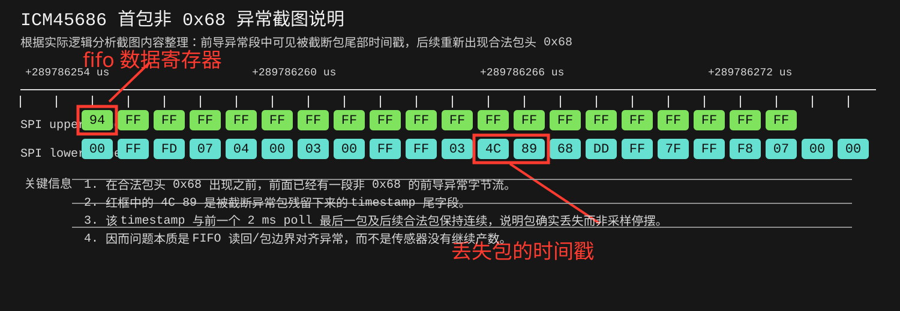
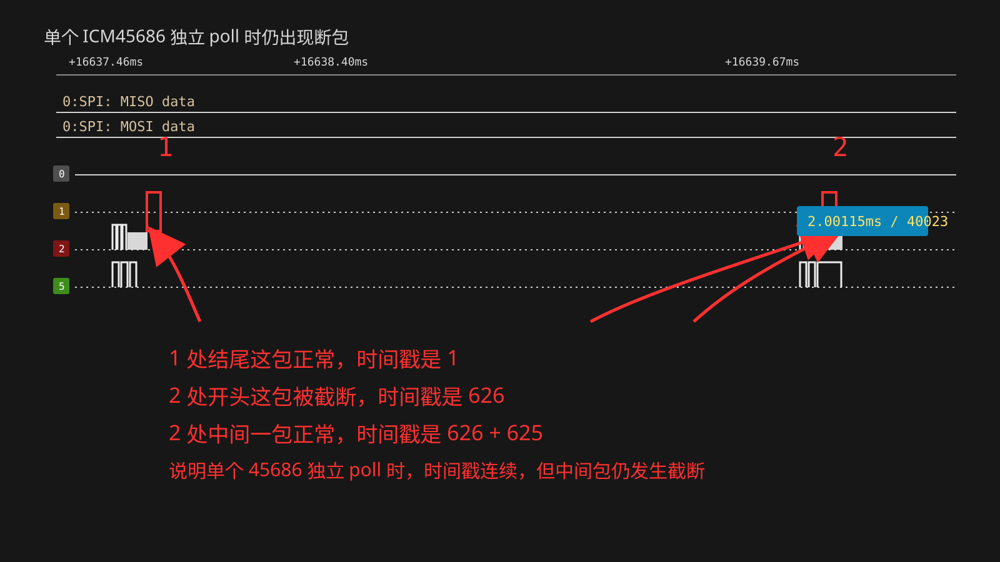
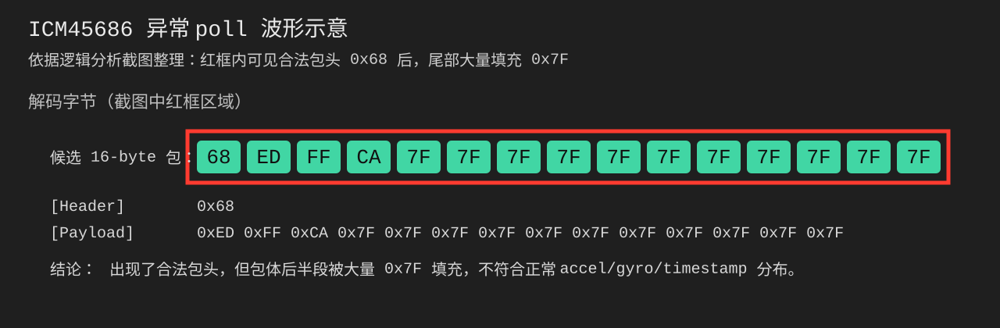
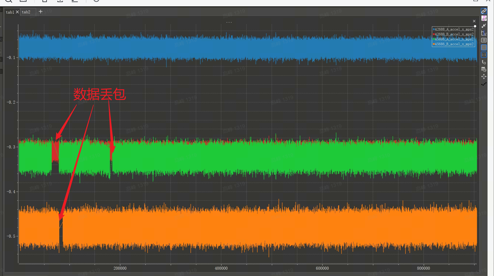

# 04. ICM45686 FIFO Poll 丢包问题报告

## 目录

1. 问题描述
2. 异常现象
3. 当前配置
4. 需求
5. ICM42688 对照

## 1. 问题描述

当前项目中，`ICM45686` 采用 FIFO 输出，上层通过固定周期 `2 ms poll` 读取数据，不使用中断触发。

当前测试条件：

- `ODR = 1600 Hz`
- FIFO 按 `16 byte` 固定包解析
- FIFO 包中带 timestamp 尾字段

理论上：

- `1600 Hz` 对应单包周期约 `625 us`
- `2 ms poll` 单次应读到约 `3` 到 `4` 个包

当前实际现象是：

- FIFO 数据流存在包头错位
- 部分包体出现异常污染
- 最终表现为断包/丢包

从当前测试观察看，异常还具有明显的时段性特征：

- 通常是在连续正常读取数分钟之后开始出现
- 异常出现后，并不是一直持续，有时又会自行恢复正常
- 按当前观察口径，一小时内大约会出现 `2` 到 `8` 次
- 单次异常持续时间通常为数十秒

问题可概括为：

> 在 `2 ms poll + 1600 Hz ODR + 16-byte FIFO packet` 条件下，`ICM45686` 的 FIFO 读回不稳定，无法持续输出完整连续的数据包。

## 2. 异常现象

### 2.1 现象一：poll 起始段不是 `0x68`

正常情况下，当前 `16 byte` FIFO 包应始终以 `0x68` 开头。



异常数据示例：

```text
00 FF FD 07 04 00 03 00 FF FF 03 4C 89
```

该现象说明：

- poll 读回的首段数据不是合法包头
- 首段长度也不满足 `16 byte` 包边界
- 后续虽然可能重新出现 `0x68`，但当前 poll 已经发生断包

结合时间戳连续性可判断：

- 传感器采样本身没有中断
- 异常点在 FIFO 读回后的包边界与包完整性

补充抓图如下，当前已经确认即使只对单个 `ICM45686` 进行 `poll`，仍然会出现同类断包现象：



从这张图可以直接得到：

- `1` 处结尾的数据包正常，时间戳为 `1`
- `2` 处开头的数据包已经被截断，时间戳为 `626`
- `2` 处中间还能看到一个正常包，其时间戳为 `626 + 625`
- 两次 poll 之间的时间间隔约为 `2.00115 ms`

这进一步说明：

- 断包现象并不依赖“多个 IMU 同时 poll”
- 在单个 `45686` 独立被 poll 的条件下，问题仍然可以复现
- 时间戳序列保持连续，但其中一个包在读回时被截断
- 因此问题更集中在 `ICM45686` 的 FIFO 读回链路或包边界处理

### 2.2 现象二：包头是 `0x68`，但包体异常

异常数据示例：

```text
68 ED FF CA 7F 7F 7F 7F 7F 7F 7F 7F 7F 7F 7F 7F
```



该现象说明：

- 包头仍然是 `0x68`
- 但包体大量退化为 `0x7F`
- 这一包不能视为有效 FIFO 数据

### 2.3 小结

当前 `ICM45686` 的异常可归纳为两类：

1. 包头错位，无法按 `16 byte` 固定包对齐
2. 包头合法，但包体被异常字节污染

两类异常都会导致 FIFO 数据流无法稳定解析，并最终表现为断包/丢包。

## 3. 当前配置

### 3.1 当前 UI 路径状态

| 项目           | 当前状态                        |
| -------------- | ------------------------------- |
| UI 接口        | SPI                             |
| accel 模式     | low-noise                       |
| gyro 模式      | low-noise                       |
| accel 量程     | `±16 g`                      |
| gyro 量程      | `±2000 dps`                  |
| accel ODR      | `1600 Hz`                     |
| gyro ODR       | `1600 Hz`                     |
| FIFO 模式      | `stream`                      |
| FIFO watermark | `1 frame`，仅作为门限参数保留 |
| FIFO 内容      | accel + gyro + timestamp tail   |
| FIFO 包长      | `16 byte`                     |
| poll 周期      | `2 ms`                        |

### 3.2 关键寄存器配置

| 寄存器              | 地址            | 最终值       | 说明                              |
| ------------------- | --------------- | ------------ | --------------------------------- |
| `SMC_CONTROL_0`   | `MREG 0xA258` | `bit0 = 1` | 打开 timestamp                    |
| `TMST_WOM_CONFIG` | `0x23`        | best-effort  | 期望绝对时间戳                    |
| `ACCEL_CONFIG0`   | `0x1B`        | `0x15`     | `±16 g`, `1600 Hz`           |
| `GYRO_CONFIG0`    | `0x1C`        | `0x15`     | `±2000 dps`, `1600 Hz`       |
| `FIFO_CONFIG4`    | `0x22`        | `0x02`     | 打开 timestamp/fsync 尾字段       |
| `FIFO_CONFIG1_0`  | `0x1E`        | `0x01`     | watermark 低字节                  |
| `FIFO_CONFIG1_1`  | `0x1F`        | `0x00`     | watermark 高字节                  |
| `FIFO_CONFIG2`    | `0x20`        | `0x08`     | watermark 条件为 `>= threshold` |
| `FIFO_CONFIG3`    | `0x21`        | `0x07`     | accel + gyro +`FIFO_IF_EN` 打开 |
| `PWR_MGMT0`       | `0x10`        | `0x0F`     | accel / gyro 进入 low-noise       |
| `FIFO_CONFIG0`    | `0x1D`        | `0x47`     | FIFO 工作在 stream 模式           |

补充说明：

- 当前 `poll` 路径通过读取 `FIFO_COUNT` 决定本次读取长度
- watermark 不是当前 `poll` 的触发条件
- 按上文这组当前配置进行测试时，问题可以非常容易复现

### 3.3 当前未主动配置、保持上电初始值的 UI 滤波器相关寄存器

除上表中的 ODR、量程、FIFO 和 timestamp 相关寄存器外，当前 `ICM45686` 主路径没有主动改写 UI 滤波器相关寄存器，当前等效状态为“保持芯片上电默认值”。

其中与 UI 主路径滤波器直接相关的寄存器如下：

| 寄存器                 | 地址            | 当前状态                | 说明                                                                                                             |
| ---------------------- | --------------- | ----------------------- | ---------------------------------------------------------------------------------------------------------------- |
| `IPREG_SYS1_REG_172` | `MREG 0xA4AC` | 保持上电默认值 `0x80` | `GYRO_UI_LPFBW_SEL[2:0]=000`，当前等效为 gyro UI LPF bypass；bit7=`GYRO_OIS_HPF1_BYP=1` 为 AUX1/OIS 路径配置 |
| `IPREG_SYS2_REG_131` | `MREG 0xA583` | 保持上电默认值 `0x00` | `ACCEL_UI_LPFBW_SEL[2:0]=000`，当前等效为 accel UI LPF bypass                                                  |

补充说明：

- 当前 `ICM45686::configureForPolling()` 没有主动调用这两个 UI LPF 相关 MREG 的写操作
- 因此当前主路径滤波器状态不是“软件显式配置后的结果”，而是“沿用芯片上电默认值”
- 按当前默认值理解，主路径 `gyro UI LPF` 与 `accel UI LPF` 都处于 bypass 状态
- 这部分和 `ODR/FSR/FIFO` 配置不同，当前驱动没有主动收敛到一个明确的 UI 滤波器带宽设置

### 3.4 复现操作步骤

下面给出当前问题的完整复现步骤，目标是稳定复现 `ICM45686` 在 `poll` 读取下的 FIFO 断包现象。

按本节上面列出的当前配置执行时，该问题通常可以非常容易复现。

1. 准备固件，确保当前 `ICM45686` 驱动配置为本文档所列寄存器状态：
   - `ODR = 1600 Hz`
   - FIFO 为 `stream` 模式
   - FIFO 包长为 `16 byte`
   - FIFO 内容为 accel + gyro + timestamp tail
   - 上层读取方式为固定周期 `2 ms poll`
2. 准备测试程序，确保采集线程只轮询单个 `45686`，避免多个 IMU 同时 poll 对结果造成干扰。
3. 编译并下载固件到目标板，上电启动。
4. 连接串口或控制台，确认 `45686` 设备枚举正常，并完成初始化。
5. 通过控制台启动原始 FIFO 采集。
   - 可先执行 `imu_poll_probe` 确认可采集设备数量
   - 再执行 `imu_poll_start`
6. 保持采集运行一段时间，建议至少持续数十秒到数分钟，以提高复现概率。
7. 采集完成后执行 `imu_poll_stop`，保存输出的原始 `.BIN` 数据文件。
8. 使用现有分析脚本或上位机工具检查每次 poll 读回的 FIFO 数据，重点关注以下特征：
   - 首段不是 `0x68`
   - 数据长度无法按 `16 byte` 整除
   - 包头是 `0x68`，但包体大量出现 `0x7F`
   - 相邻包时间戳连续，但中间包无法恢复成完整 `16 byte` 包
9. 若日志中出现 FIFO 解析失败，也可直接结合驱动报错信息辅助判断。
   - 例如 `fatal_fifo_parse`
   - 或 `parse_mismatch`

判定为复现成功的标准：

- 在原始 FIFO 数据或日志中观察到“首段不是 `0x68`”的错位现象
- 或观察到“包头是 `0x68` 但包体大量为 `0x7F`”的污染现象
- 或能确认 FIFO 数据流无法持续按 `16 byte` 固定包稳定解析

### 3.5 当前判断包合法的代码

当前驱动对 `ICM45686` FIFO 包合法性的判断逻辑非常直接：按 `16 byte` 固定包步进，只检查每个包的首字节是否为 `0x68`。

对应代码如下：

```cpp
static bool IsValidFifoPacket16(const uint8_t *packet, uint16_t len) {
  if (packet == nullptr || len < kPacketSize16) {
    return false;
  }

  return packet[0] == kFifoHeader16Value;
}

static uint32_t CalculateValidFifoLen16(const uint8_t *buf, uint32_t buf_len, uint16_t *packet_count) {
  uint32_t valid_buf_len = 0;

  if (packet_count == nullptr) {
    return 0U;
  }

  *packet_count = 0U;
  while ((valid_buf_len + kPacketSize16) <= buf_len) {
    const uint8_t *packet = &buf[valid_buf_len];

    if (!IsValidFifoPacket16(packet, kPacketSize16)) {
      break;
    }

    valid_buf_len += kPacketSize16;
    (*packet_count)++;
  }

  return valid_buf_len;
}
```

读取 FIFO 数据后的实际调用位置如下：

```cpp
valid_buf_len = CalculateValidFifoLen16(data.fifo_data, bytes_to_read, &packet_count);
if (valid_buf_len == 0U || packet_count == 0U) {
  ...
}
```

这意味着当前判定规则是：

- 只要某个 `16 byte` 包的首字节不是 `0x68`，解析就会在该处中断
- 因此，一旦出现首段错位或异常污染，就会直接表现为 FIFO 解析失败

### 3.6 异常包对应的逻辑分析仪波形

出现异常包时，逻辑分析仪已经抓到两类对应波形。

1. 首段不是 `0x68` 的异常波形：


对应说明：

- 连续 burst read 已经开始读取 FIFO 数据
- 起始段不是合法包头
- 异常段中仍保留了被截断包的时间戳尾字段

2. 包头合法但包体异常的波形：


对应说明：

- 包头仍然可见为 `0x68`
- 但包体中大量字节退化为 `0x7F`
- 这一包虽然看起来像完整包，但内容已经失效

## 4. 需求

需求边界：

- 必须继续使用 `poll` 方式读取 FIFO
- 不接受切换成中断触发方式规避问题

最终要求：

- `poll` 读出的数据必须稳定按 `16 byte` 固定包解析
- 每个有效包都应以 `0x68` 开头
- 不能再出现首段错位
- 不能再出现包体大量 `0x7F`
- 时间戳应保持连续
- FIFO 数据输出不能丢包

验收口径：

- 在 `ODR = 1600 Hz`、`poll = 2 ms`、`FIFO packet = 16 byte` 条件下持续运行
- 单次 poll 读回的数据要么为空，要么能完整拆分成若干个合法 `16 byte` 包
- 累计输出包数与理论采样数一致，不允许出现可观测漏包

## 5. ICM42688 对照

在当前项目中，`ICM42688` 同样采用固定周期 `2 ms poll` 读取 FIFO，但未出现 `ICM45686` 的上述两类异常。

补充对比结论如下：

- 当前项目对 `4` 个 IMU 同时进行了读取对比
- 其中 `2` 个 `ICM42688` 均未出现上述断包/丢包问题
- 另外 `2` 个 `ICM45686` 均复现了本文描述的异常现象

对应四路 IMU 对比示意如下：

这说明：

- 当前问题并不是单颗 `45686` 个例
- 在本项目现有 `4` 颗 IMU 的对比结果里，问题稳定集中出现在 `2` 个 `ICM45686` 上
- `2` 个 `ICM42688` 在相同上层 `poll` 框架下均表现正常

### 5.1 对照结论

- 未出现 poll 起始段不是合法包头的现象
- 未出现包头合法但包体大量 `0x7F` 的现象
- 未出现持续性断包/丢包

因此，当前问题集中在 `ICM45686` 的 FIFO 读回链路，而不是 `poll` 机制本身。

### 5.2 ICM42688 关键寄存器配置

| 寄存器                        | 地址     | 最终值   | 说明                                    |
| ----------------------------- | -------- | -------- | --------------------------------------- |
| `REG_INTF_CONFIG0`          | `0x4C` | `0x33` | SPI + FIFO count / sensor data 大端模式 |
| `REG_ACCEL_CONFIG0`         | `0x50` | `0x06` | `±16 g`, `1000 Hz`                 |
| `REG_GYRO_CONFIG0`          | `0x4F` | `0x06` | `±2000 dps`, `1000 Hz`             |
| `REG_FIFO_CONFIG`           | `0x16` | `0x40` | FIFO 工作在 `stream` 模式             |
| `REG_FIFO_CONFIG_1`         | `0x5F` | `0x07` | FIFO 使能 accel + gyro + temp           |
| `REG_PWR_MGMT_0`            | `0x4E` | `0x0F` | accel / gyro 进入 low-noise             |
| `REG_SIGNAL_PATH_RESET_REG` | `0x4B` | flush    | 上电后执行一次 FIFO flush               |

### 5.3 ICM42688 当前滤波器相关说明

需要特别说明的是：当前这版 `ICM42688` 初始化代码虽然保留了滤波器相关接口，但在实际执行的 `DebugInit(false)` 路径中，没有看到显式调用以下函数：

- `icm4x6xx_set_accel_filter_order(...)`
- `icm4x6xx_set_gyro_filter_order(...)`
- `icm4x6xx_set_accel_bandwidth(...)`
- `icm4x6xx_set_gyro_bandwidth(...)`

因此，当前 `ICM42688` 主路径滤波器参数应理解为“保持芯片上电默认状态”，而不是“初始化阶段已被当前代码显式重设”。

当前更准确的表述应为：

- `ICM42688` 代码中具备滤波器相关配置接口
- 但当前这版实际初始化路径未显式配置主路径滤波器参数
- 因此这里应按芯片上电默认滤波器状态来理解当前配置

按当前 `ICM42688-P` 官方 datasheet 的上电默认值，相关 UI 滤波器寄存器状态如下：

| 寄存器                     | 地址     | 上电默认值 | 当前默认滤波器状态说明                                                                                                 |
| -------------------------- | -------- | ---------- | ---------------------------------------------------------------------------------------------------------------------- |
| `REG_GYRO_CONFIG1`       | `0x51` | `0x16`   | `GYRO_UI_FILT_ORD[3:2] = 01`，即 gyro UI filter 默认是二阶                                                           |
| `REG_GYRO_ACCEL_CONFIG0` | `0x52` | `0x11`   | 高四位 `ACCEL_UI_FILT_BW = 1`，低四位 `GYRO_UI_FILT_BW = 1`，即 accel / gyro UI LPF 默认均为 `max(400Hz, ODR)/4` |
| `REG_ACC_CONFIG1`        | `0x53` | `0x0D`   | `ACCEL_UI_FILT_ORD[4:3] = 01`，即 accel UI filter 默认是二阶                                                         |

也就是说，若按当前这版代码实际执行结果理解：

- `ICM42688` 并不是“没有滤波器”
- 而是当前主路径滤波器保持芯片上电默认状态
- 默认 UI filter order 为二阶
- 默认 UI LPF 带宽为 `max(400Hz, ODR)/4`

### 5.4 ICM42688 当前状态

| 项目       | 当前状态            |
| ---------- | ------------------- |
| UI 接口    | SPI                 |
| accel 模式 | low-noise           |
| gyro 模式  | low-noise           |
| accel 量程 | `±16 g`          |
| gyro 量程  | `±2000 dps`      |
| accel ODR  | `1000 Hz`         |
| gyro ODR   | `1000 Hz`         |
| FIFO 模式  | `stream`          |
| FIFO 内容  | accel + gyro + temp |
| FIFO 包长  | `16 byte`         |
| poll 周期  | `2 ms`            |
